# Task :

1\. Secara konsep, jelaskan apa itu DevOps dengan bahasa kalian!

2\. Install Ubuntu Server 22.04.x LTS menggunakan Virtualbox/VMware/Virtualization Tool pilihan kalian dan buat step-by-step langkah instalasinya!

3\. Gunakan IP Address xxx.xxx.xxx.208 untuk server VM kalian!

4\. Pastikan Ubuntu Server kalian ada jaringan dengan test menggunakan command \`ping 8.8.8.8\` / \`ping google.com\`

# Apa itu DevOps?

DevOps adalah sebuah praktik penengembangan software dengan budaya kerja yang menyatukan developer dan operator. Bukan hanya sekedar dev dan ops yang bekerja sama tetapi mereka juga saling berbagi tanggung jawab dan kepentingan selama masa siklus penngembangan software itu berlangsung.

# Installasi Ubuntu Server

Di sini saya menggunakan Virtualbox untuk menginstall server.

- Download Virtualbox <https://www.virtualbox.org/wiki/Downloads>

- Download Ubuntu Server <https://ubuntu.com/download/server#manual-install-tab>

Setelah semua sudah di download berikut langkah -- langkah installasinya :

1.  Pertama Buka Virtualbox yang sudah terinstall dan klik New Virtual Machine

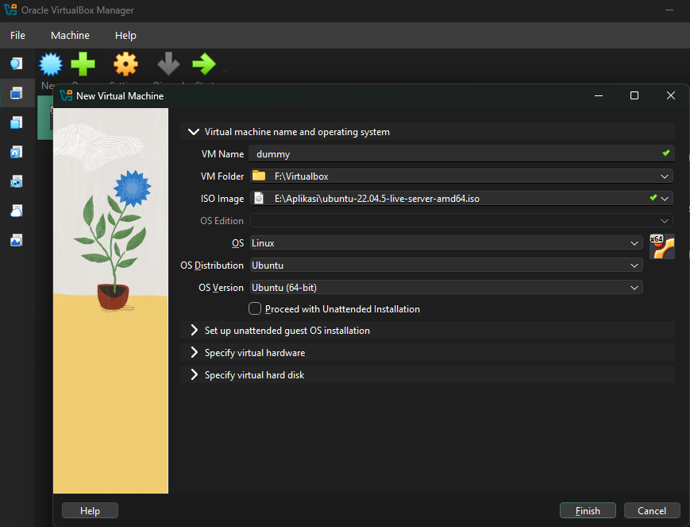{width="6.268055555555556in" height="4.782638888888889in"}

- Isi VM Name dengan nama server

- Pilih VM Folder sesuai dengan direktori

- Pilih ISO Image sesuai dengan direktori penyimpanan file Ubuntu Server yang telah di download

- Skip Unattended Installation

2.  Klik Specify virtual hardware

Di sini saya ingin menggunakan base memory 2GB dan CPU 2 core

{width="6.268055555555556in" height="2.0680555555555555in"}

3.  Klik Specify virtual hardisk

Di sini saya ingin menggunakan 10 GB storage untuk penyimpanan VM saya

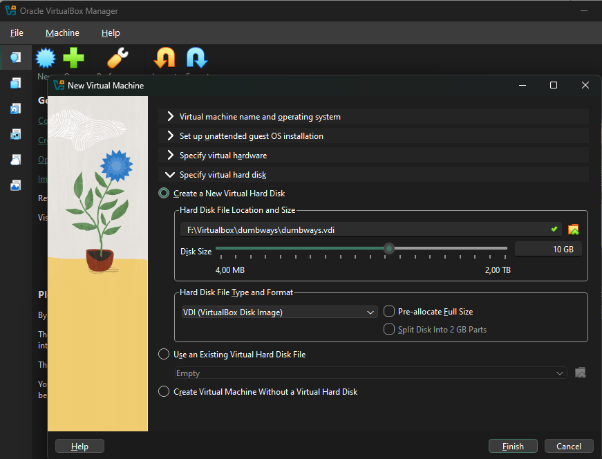{width="6.268055555555556in" height="4.778472222222222in"}

4.  Jika set up sudah selesai klik Finish dan Klik Start untuk menjalankan installasi server pada VirtualBox

5.  Pilih bahasa English

{width="6.268055555555556in" height="4.497916666666667in"}

6.  Pilih continue without updating

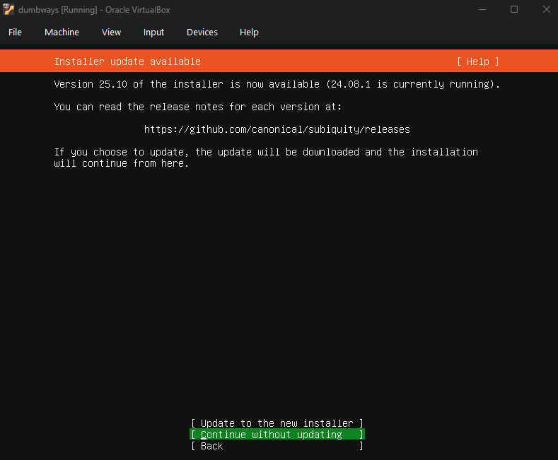{width="6.268055555555556in" height="5.1715277777777775in"}

7.  Pilih konfigurasi keyboard English dan pilih Done

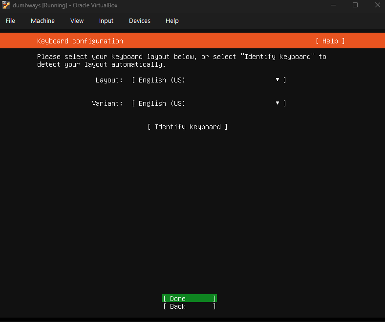{width="6.268055555555556in" height="5.25in"}

8.  Pilih centang Ubuntu Server dan pilih Done

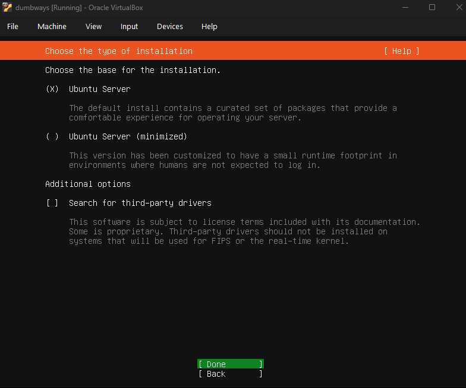{width="6.268055555555556in" height="5.228472222222222in"}

9.  Konfigurasi jaringan agar VM dapat mengakses internet. Atur manual agar nantinya VM dapat di Akses dari komputer luar. Cara Setting jaringan adalah sebagai berikut.

- Buka CMD ketik "ipconfig", tekan enter

- Cek & Cari IPv4 kamu

{width="4.625645231846019in" height="2.792055993000875in"}

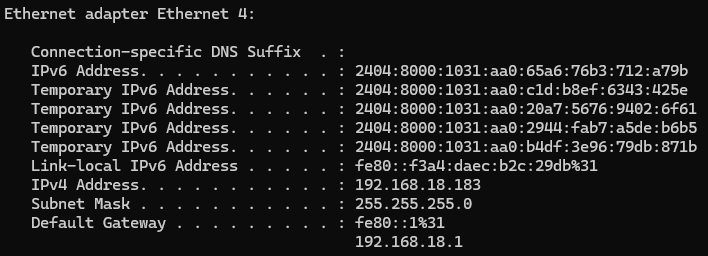{width="6.268055555555556in" height="2.265972222222222in"}

- Jika sudah ketemu, masuk ke setting IPv4 di VM nya dan pilih edit IPv4

{width="6.268055555555556in" height="2.4472222222222224in"}

- Pilih Manual

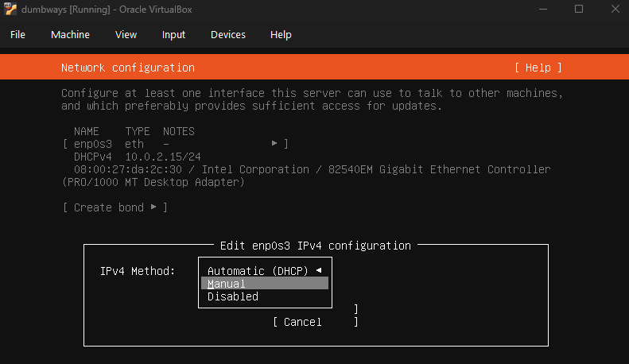{width="6.268055555555556in" height="3.629166666666667in"}

- Isi Subnet dengan yang sesuai dengan jaringan asli, yaitu 192.168.18.0

- Isi Address dengan IP unik (Jangan sama dengan IPv4 address asli), yaitu 192.168.18.208

- Isi Gateway sesuai dengan default gateway jaringan asli, yaitu 192.168.18.1

- Isi Name Server dengan DNS server, di sini saya gunakan DNS cloudflare, yaitu 1.1.1.1, 1.0.0.1

- Setelah semua sudah terisi pilih Save

{width="6.268055555555556in" height="4.607638888888889in"}

- Lalu pilih Done\
  {width="6.268055555555556in" height="5.131944444444445in"}

10. Kofigurasi Proxy kosongkan/skip, pilih Done\
    {width="6.268055555555556in" height="5.076388888888889in"}

11. Konfigurasi Ubuntu Archive mirror, skip pilih Done dan Continue

{width="6.268055555555556in" height="5.1875in"}

12. Konfigurasi storage, pilih custom sotrage layout agar dapat menyesuaikan partisi VM kita nanti, pilih done

{width="6.268055555555556in" height="5.136111111111111in"}

- Atur storage, tambahkan partisi GPT di sini saya pakai 7 GB, lalu pilih create

{width="6.268055555555556in" height="5.122222222222222in"}

- Kemudian untuk sisa space yang masih tersedia saya tambah partisi untuk Swap (ini berfungsi sebagai penambah RAM sementara, jika RAM VM penuh). Pilih Create

{width="6.268055555555556in" height="5.120833333333334in"}

- Setelah konfigurasi penyimpanan selesai, pilih Done lalu Continue

{width="6.268055555555556in" height="5.096527777777778in"}

13. Konfigurasi profil, isi profile konfiguration dan pilih Done

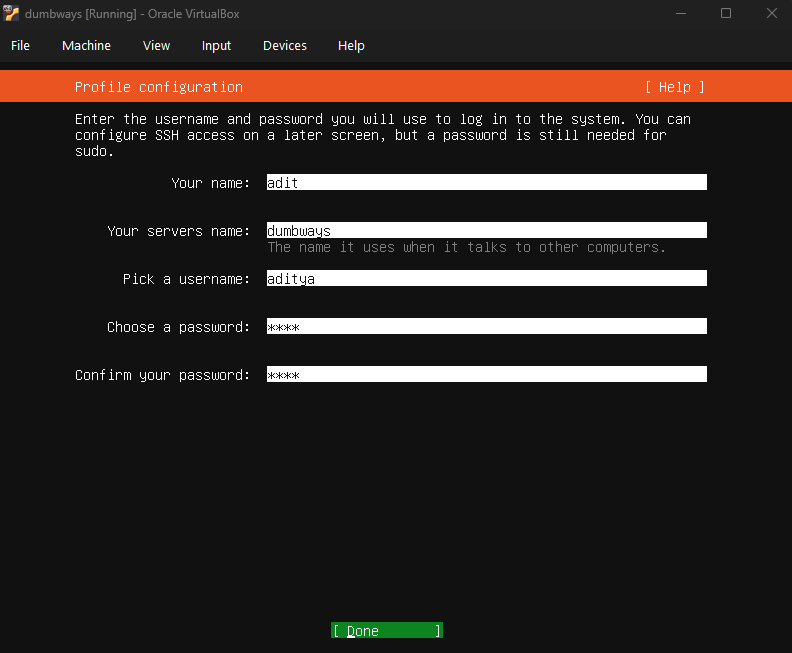{width="6.268055555555556in" height="5.168055555555555in"}

- SSH konfiguration, di sini saya memilih tidak menginstall open SSH, saya menginstall Ubuntu secara bersih. Pilih Done

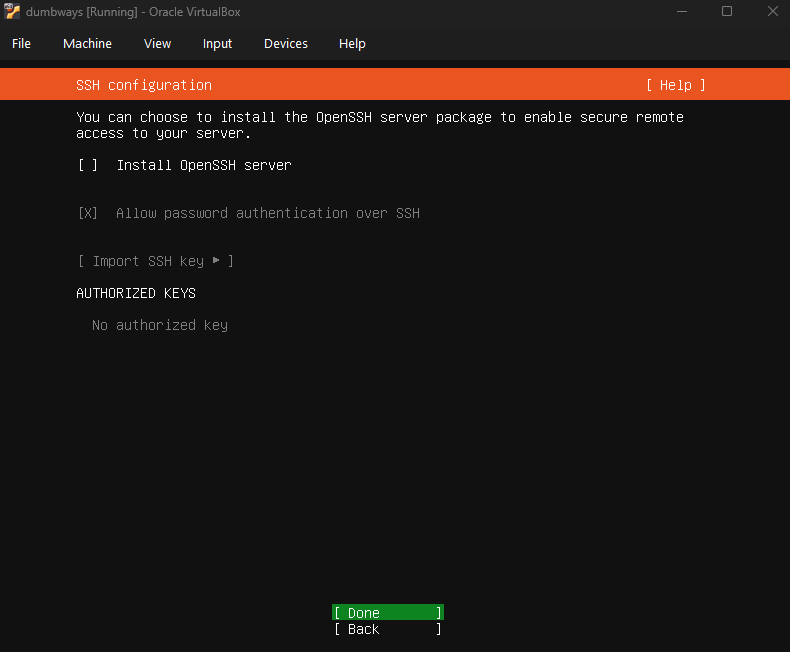{width="6.268055555555556in" height="5.172916666666667in"}

- Tunggu proses installasi selesai.

14. Setelah Installasi Selesai, pilih reboot

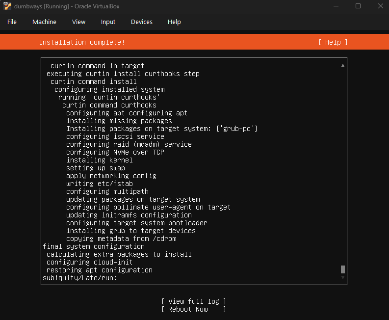{width="6.268055555555556in" height="5.153472222222222in"}

15. Login Server VM dengan username dan password yang sudah di setting di profil konfiguration sebelumnya. Kemudian cek koneksi dengan perintah "ping 8.8.8.8".

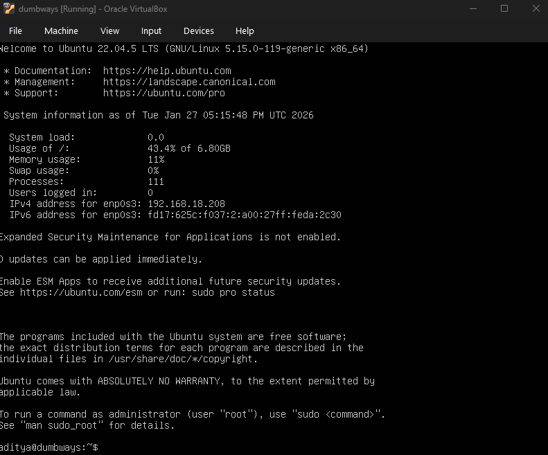{width="6.268055555555556in" height="5.20625in"}

{width="5.354913604549432in" height="1.8648436132983377in"}
