# Task :

1\. Akses server menggunakan terminal

(Windows Terminal/PuTTY/etc.)

2\. Konfigurasi ssh kalian agar bisa di akses \*hanya menggunakan publickey\* (password opsional, bisa dimatikan)

3\. Buat step by step penggunaan text manipulation! (grep, sed, cat, echo)

4\. Nyalakan ufw dengan memberikan akses untuk port 22, 80, 443, 3000, 5000 dan 6969!

# Akses Server Via SSH Menggunakan Terminal

Langkah – Langkah :

1.  Cek ip server VM dengan perintah “ip a” pada server VM

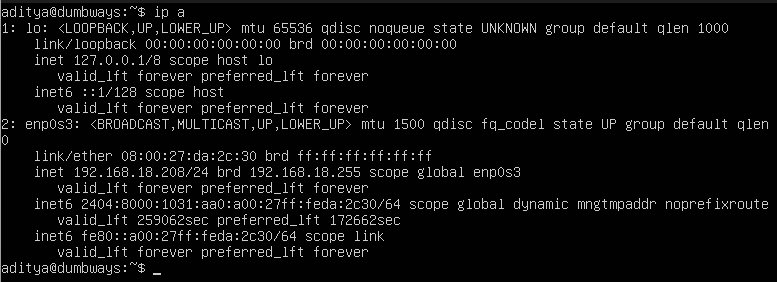

2.  Install openssh-server pada server dengan perintah “sudo apt install openssh-server”

3.  Cek status sistem pada server apakah openssh sudah berjalan / belum dengan perintah “systemctl status ssh”

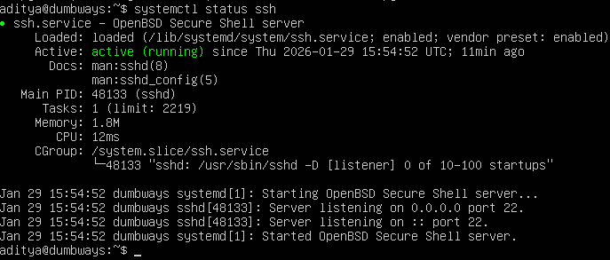

4.  Jika sudah, beralih ke terminal windows dan masukkan perintah “ssh \<user-server@ip-server\>”. Di sini saya memasukkan perintah sesuai dengan user dan ip server saya “ssh <aditya@192.168.18.208>”. Nanti akan diminta untuk verifikasi fingerprint ketik “yes” dan enter, lalu masukkan password server dan tekan enter.

5.  Selesai, sudah berhasil masuk ke server melalui terminal windows

# Konfigurasi SSH

Agar dapat mengakses server dengan publik key tanpa memasukkan password. Langkah – langkah :

1.  Buka terminal windows dan gunakan perintah “ssh-keygen”

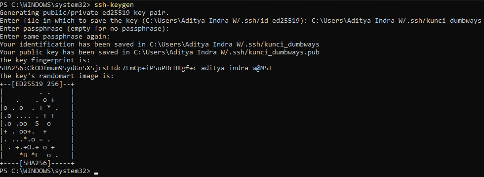

2.  Masuk ke direktori hasil generating publik key ssh dengan perintah cd “C:\Users\Aditya Indra W\\ssh” dan ls untuk menampilkan isi file yang ada pada direktori.

3.  Pada direktori terdapat file “kunci_dumbways.pub”. Lihat isi file tersebut dengan perintah “cat kunci_dumbways.pub”

4.  Salin isi file tersebut “ssh-ed25519 AAAAC3NzaC1lZDI1NTE5AAAAIALmQ4W/f1j6kTVajntwv/vUhnS7+8wgrUIT7zAOg9ae aditya indra w@MSI”.

5.  Login ke server VM dan masuk ke direktori /.ssh

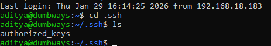

6.  Pada direktori /.ssh terdapat file authorized_keys. Edit file tersebut menggunakan perintah “nano authorized_keys”. Masukkan isi dari file yang sudah kita copy tadi.

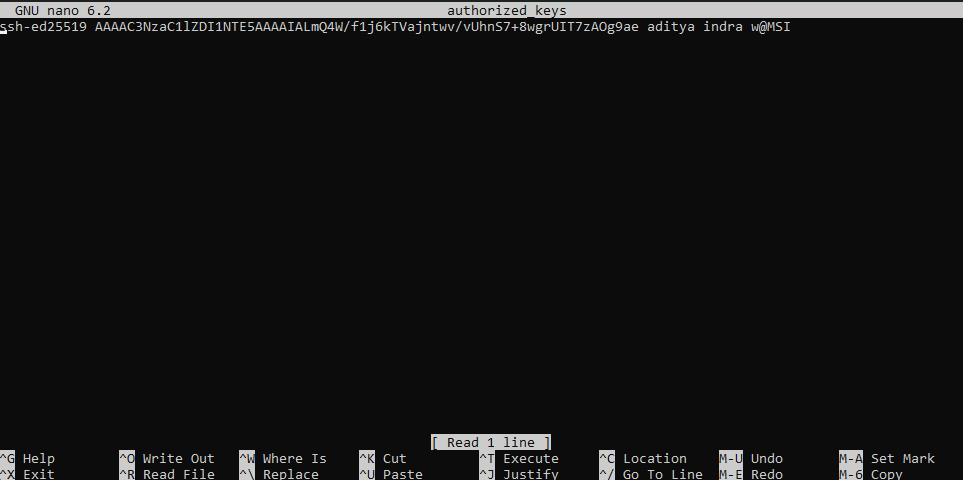

7.  Test login ke server tanpa menggunakan password dengan cara masukkan perintah “ssh -i \<direktori-kunci/nama-kunci\> user@ip”. Di sini saya menggunakan perintah “ssh -i .ssh/kunci_dumbways <aditya@192.168.18.208>”.

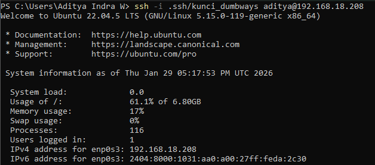

# Text Manipulation

## cat : Menampilkan isi file, menggabungkan isi file, overwrite isi file.

- Perintah “cat file1” ini akan membaca isi dari file1

- Perintah “cat \> file1” ini akan meng-overwrite isi dari sebuah file, namun jika file belum ada itu akan membuat file baru

- Perintah “cat file1 file2 \> file3” ini akan menggabungkan isi dari file1 dan file2 ke dalam isi file3

## sed : Editor stream untuk memfilter dan mentransformasi teks (find and replace).

- Perintah “sed -i ‘s/ini/berikut/g’ file1” ini akan mencari teks “ini” di dalam file1 dan mengubahnya menjadi teks “berikut”.

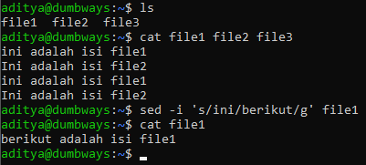

- Perintah “sed ‘s/adalah/merupakan/g’ file3” ini akan mencari, mengubah dan menampilkan isi dari file3 tanpa mengubah isi asli dari file3

## grep : Mencari pola dalam file. 

- Perintah “grep Ini file3” ini akan menunjukkan semua teks “ini” yang ada pada file3

- Perintah “grep -c Ini file3” ini akan menunjukkan jumlah teks “ini” yang ada pada file3

- Perintah “grep adalah \*” ini akan menunjukkan semua file yang mengandung teks “adalah”

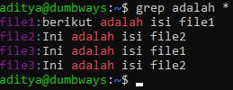

## echo : Memantulkan teks pesan ke user, menulis data ke dalam file

- Perintah “echo Hello World” ini akan menapilkan output teks “Hello World” itu sendiri

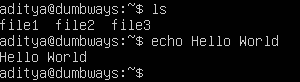

- Perintah “echo Hello World \>\> file1” ini akan menambahkan/menuliskan teks “Hello World” ke dalam file1

# Menyalakan UFW (Uncomplicated Firewall)

Kita akan menyalakan ufw dan memberikan akses untuk port 22, 80, 443, 3000, 5000 dan 6969. Langkah – langkah :

1.  Cek status UFW apakah sudah aktif / belum

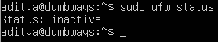

2.  Jika belum aktif, aktifkan terlebih dahulu

3.  Berikan akses untuk semua port yang ingin diberikan akses ke server

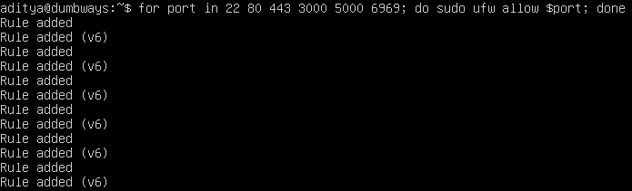

4.  Cek status ufw apakah semua port sudah diberikan akses

