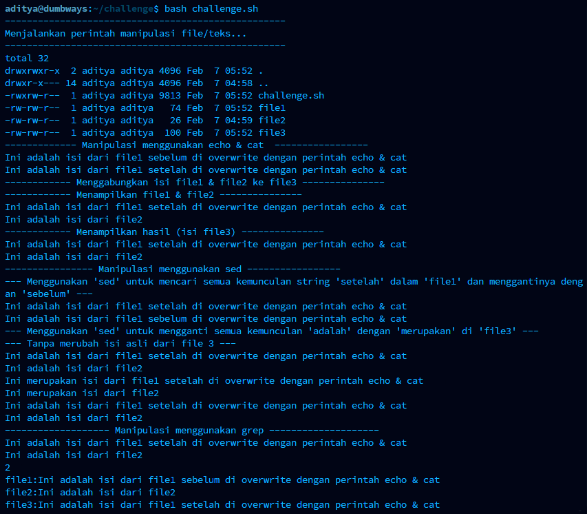
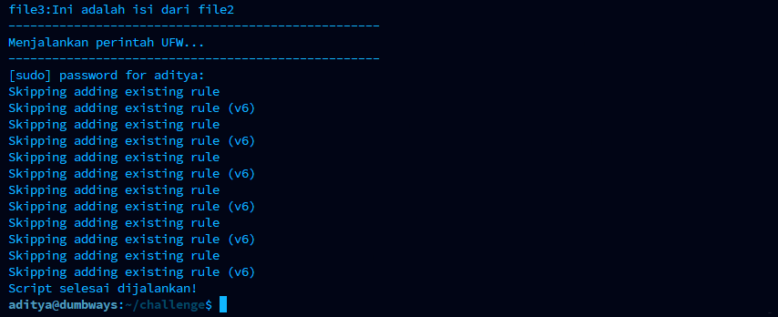
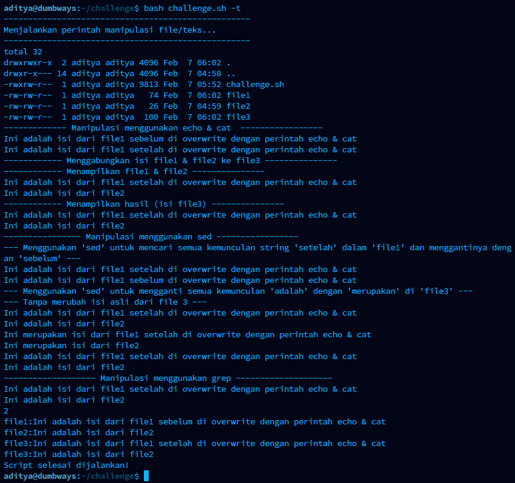
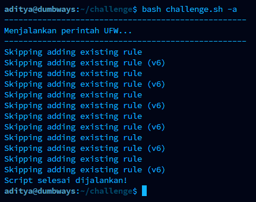

# Challenge :

1\. Jalankan tugas nomor 3 & 4 di day 3 dalam bentuk script BASH!

2\. Scriptnya bisa menyalakan/menambahkan, dan juga bisa mematikan/menghapus konfigurasinya (No. 1)

# Bash Script

Di sini saya membuat bash script challenge.sh untuk dapat secara otomatis menjalankan tugas nomor 3 & 4 pada task day 3. Hasil output dari bash script saya adalah sebagai berikut.

1.  Tanpa opsi / argumen tambahan script akan menjalankan keseluruhan task

 

2.  Untuk melihat daftar opsi dan cara penggunaannya, gunakan opsi -h

3.  Untuk menjalankan hanya task no 3 manipulasi teks / isi file, gunakan opsi -t

4.  Untuk menjalankan hanya task no 4 menyalakan ufw, gunakan opsi -a

