# Task :

1\. Penjelasan tentang git

2\. Buat sebuah repository bernama "devops26-dumbways-\<nama\>", lalu tambahkan 3 file yang berisi text

3\. Manage repository tugas kalian menggunakan terminal!

4\. Demokan cara untuk mencari perubahan text pada suatu file di GitHub!

# Apa itu Git?

Git adalah sebuah sistem yang membantu kamu melacak perubahan pada file atau kode yang kamu buat. Dengan Git, setiap kali kamu membuat perubahan penting, kamu bisa "menyimpan" versi baru dari kode yang kamu kerjakan. Ini seperti mengambil *snapshot* dari proyekmu pada saat itu.

# Membuat Repository & Menambahkan File ke Repo

1.  Buka https://github.com/login dan login dengan akun kita

2.  Setelah berhasil login buka menu / tab repository pada halaman Github

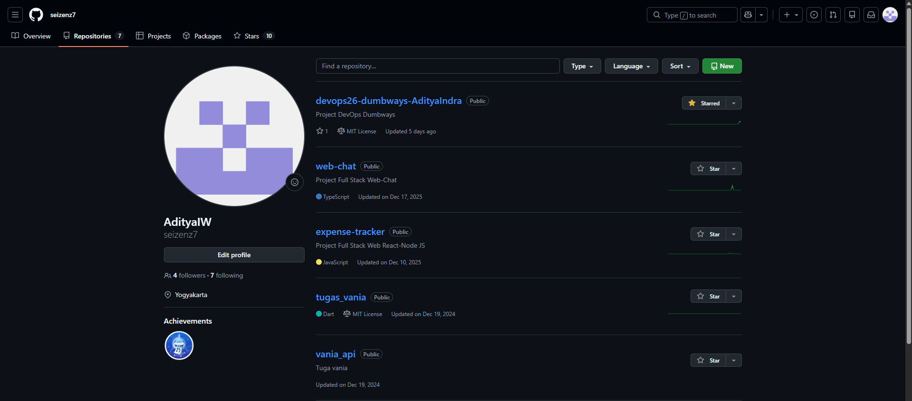

3.  Untuk mebuat sebuah repository baru klik tombol New

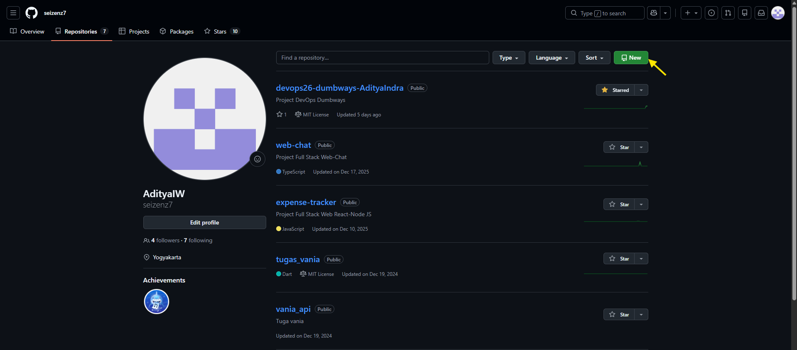

4.  Isi nama repository dan atur configurasi sesuai kebutuhan, jika sudah klik tombol Create repository

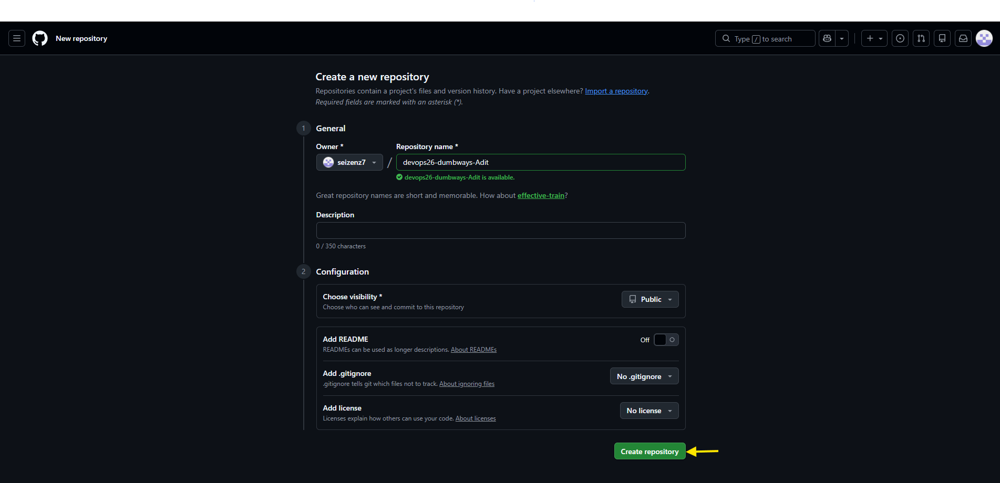

5.  Tambahkan file baru ke repo, klik “creating a new file”

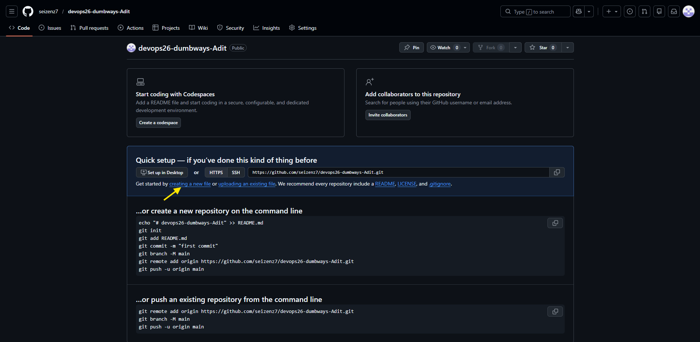

6.  Isi nama file dan buat isi filenya, lalu klik tombol commit changes

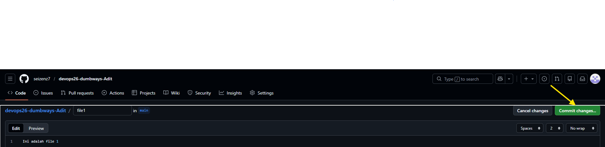

7.  Isikan commit message dan klik tombol commit changes

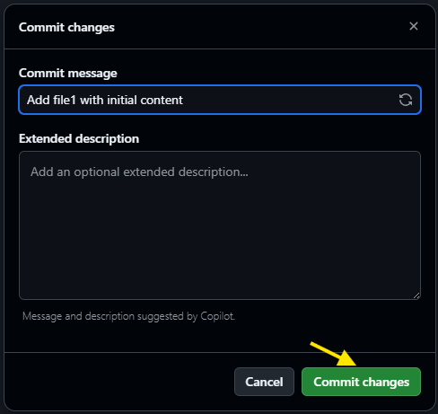

8.  Tambahkan file sebanyak 3 file

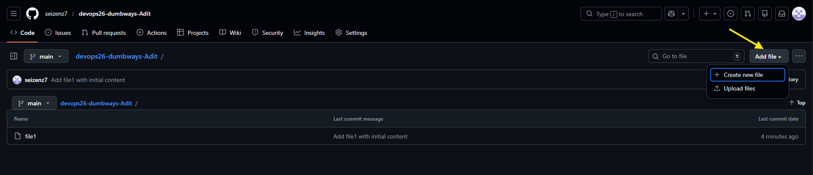

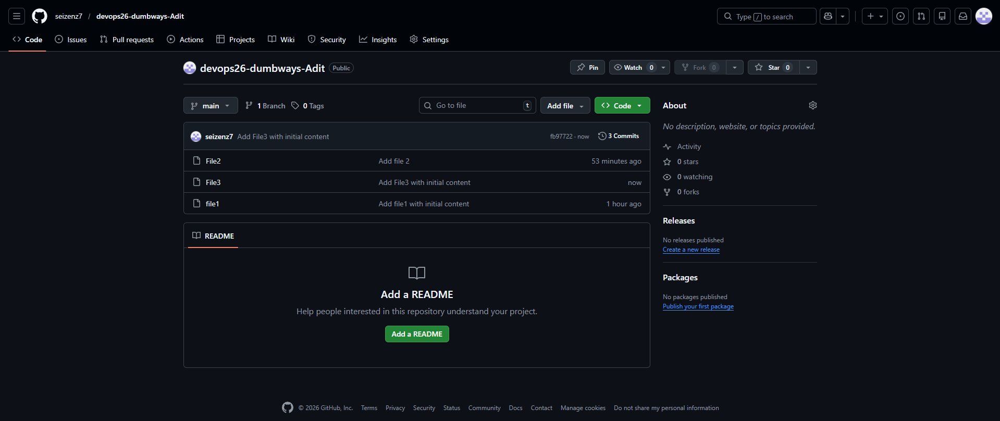

# Manage Repository Melalui Terminal

Untuk dapat memanage repo melalui server terminal kita perlu mengatur configurasi github dan koneki SSH terlebih dahulu. Berikut langkah – langkahnya:

1.  Buka terminal dan ketik perintah “git config --global user.name seizenz7”, lalu Enter dan perintah “git config --global user.email <adityaiw4@gmail.com>" ”, Enter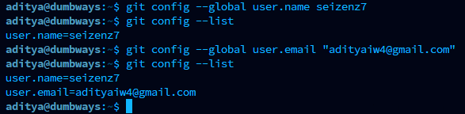

2.  Setelah mengatur konfigurasi Git, ketik perintah “ssh-keygen -t rsa -b 4096”

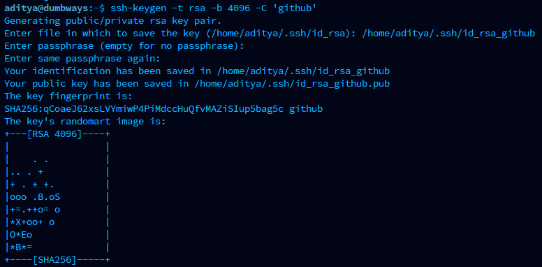

3.  Setelah ssh key tergenerate, masuk ke direktori hasil “cd /home/aditya/.ssh/”, kemudian cek isi direktorinya “ls -la”.

4.  Buka isi file id_rsa_github_pub “cat id_rsa_github_pub”, lalu copy isinya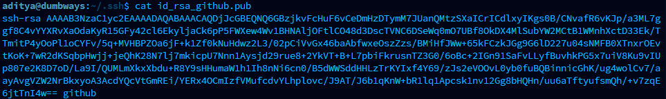

5.  Buka github.com, lalu masuk ke profile setting

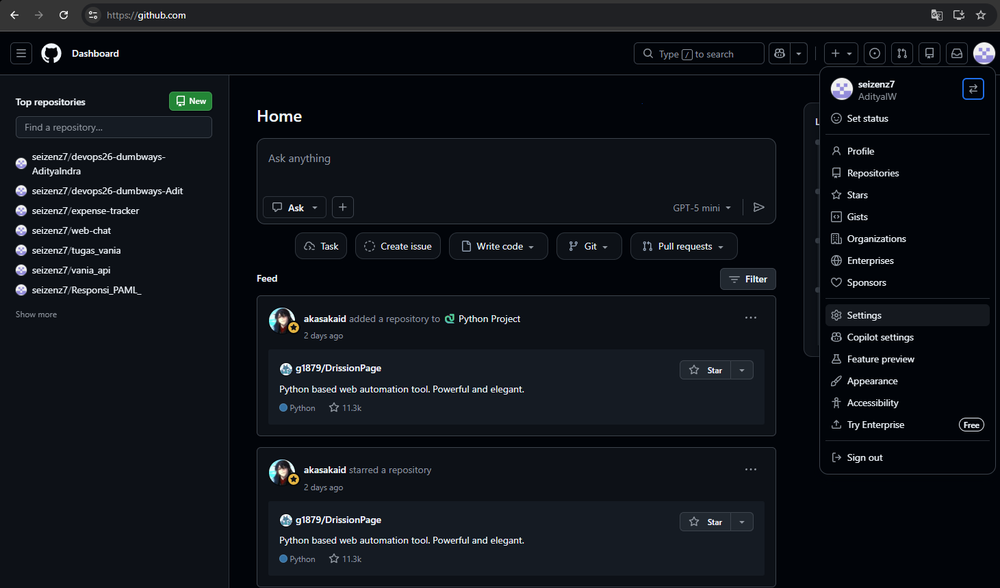

6.  Kemudian masuk ke menu ssh dan gpg keys

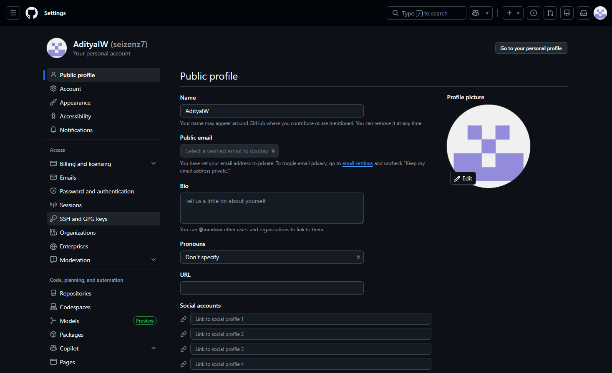

7.  Klik tombol “New SSH Key”

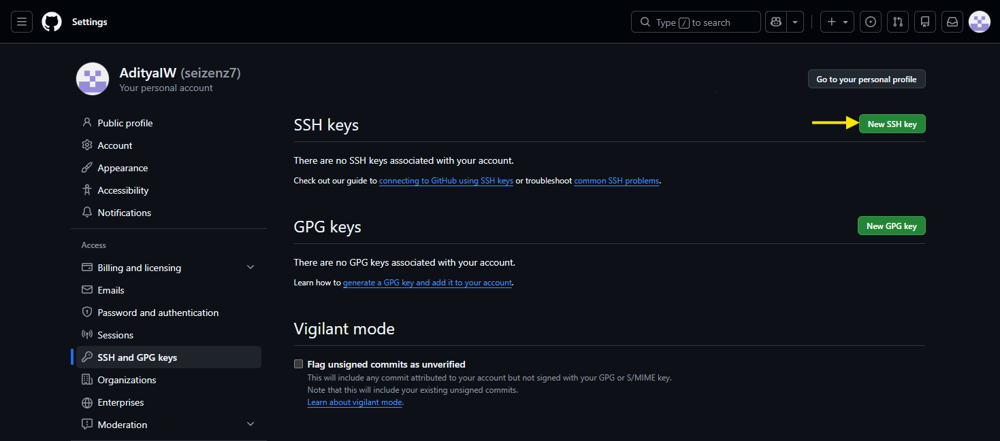

8.  Pastekan isi dari file id_rsa.pub yang sudah kita copy tadi kedalam Key, lalu klik tombol “Add SSH Key”

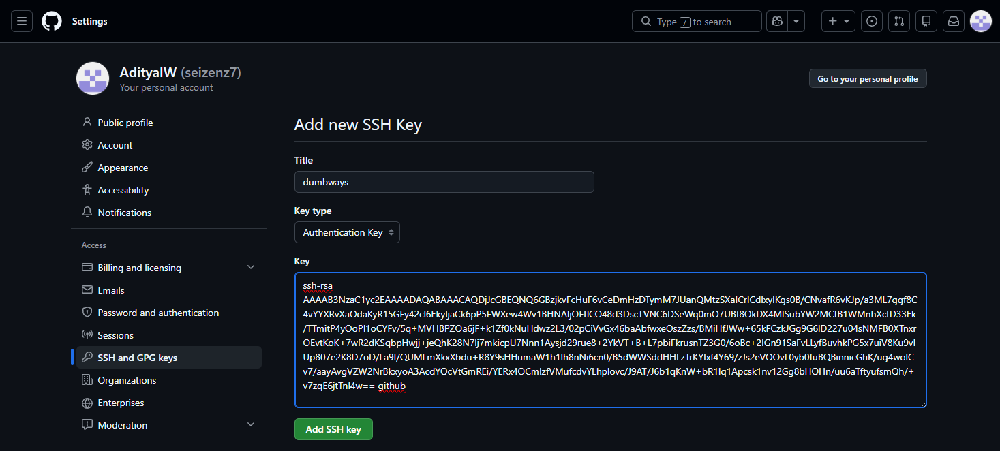

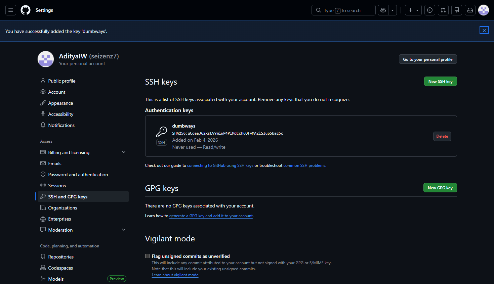

9.  Cek koneksi ssh ke Github dengan perintah “ssh -i .ssh/id_rsa_github git@github.com -T”

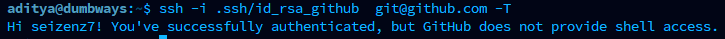

10. Membuat direktori untuk dijadikan sebuah git/repo lokal dan masuk ke direktori tersebut

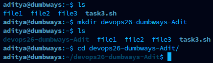

11. Lakukan inisialisasi git dengan perintah “git init.”

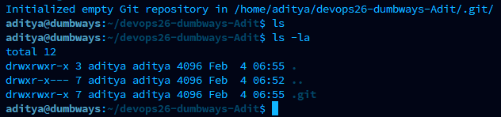

12. Setelah terinisialisasi, hubungkan repo lokal dengan repo asli yang sudah kita buat sebelumnya dengan perintah “git remote add origin \<link akses repo\>”

13. Setelah terhubung lakukan git fetch untuk mendapatkan data terbaru dari repo asli dan git pull untuk mengupate data repo lokal sesuai dengan data repo asli terbaru

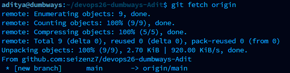

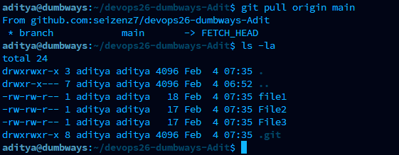

# Mencari perubahan text pada file repo github

1.  Lakukan perubahan text pada file dan klik “commit changes”

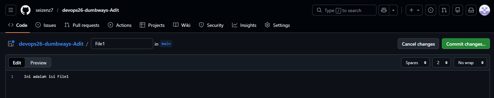

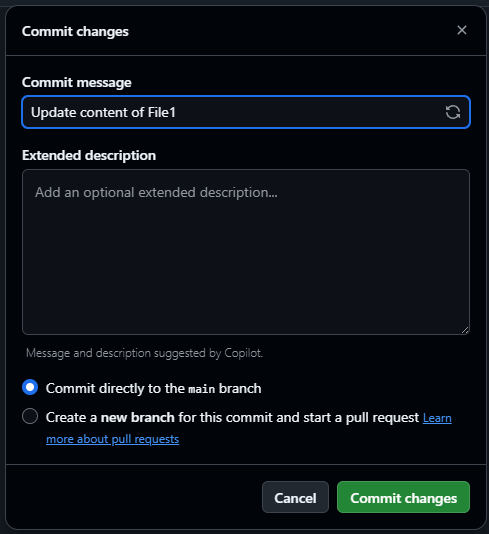

2.  Masuk ke repo dan klik pada File1 yang telah diubah sebelumnya

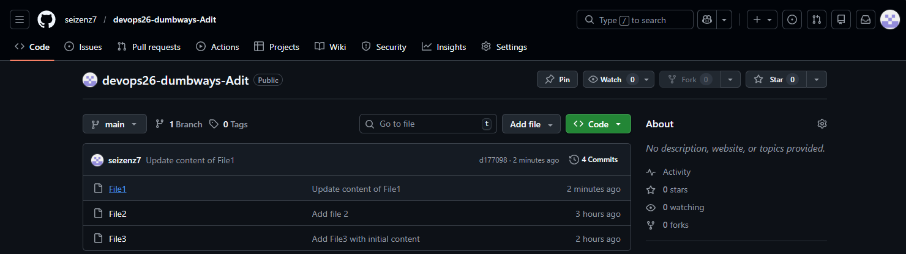

3.  Klik tombol History

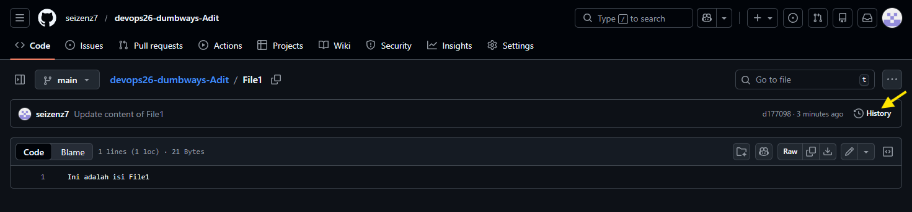

4.  Klik Update content of File1

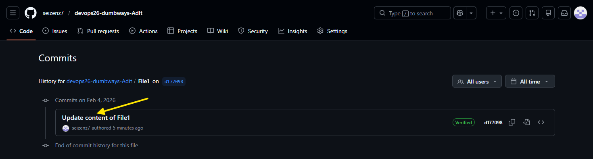

5.  Klik Load Diff untuk melihat perubahan text pada File1

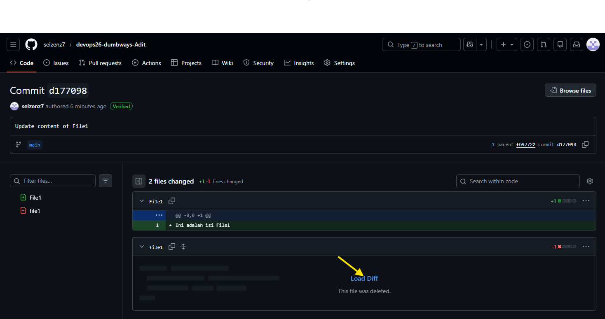

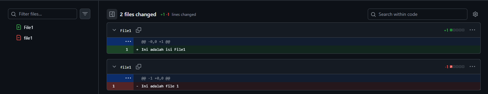
