# Challenge :

1\. NodeJS + Python berjalan di background (tanpa kondisi attached di terminal)

\- artinya, teman-teman tetep bisa menggunakan terminal di window yang sama namun app tetap berjalan

2\. Golang bisa dibuka di browser kalian, menampilkan text "Jangan lupa sahur baby gurl rawr"

# Menjalankan Aplikasi di Background

Di sini saya menggunakan tmux untuk menjalankan aplikasi agar berjalan di background tanpa kondisi attached di terminal. Berikut langkah – Langkahnya.

1.  Buka terminal, masuk ke direktori aplikasi nodejs (wayshub)

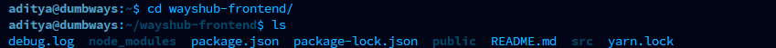

2.  Jalankan perintah tmux, buat session baru di tmux, gunakan perintah ‘ tmux new -s nodejs ‘

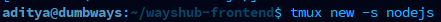

3.  Setelah sesi tmux muncul, jalankan aplikasi nodejs dengan perintah ‘ npm start ‘  
    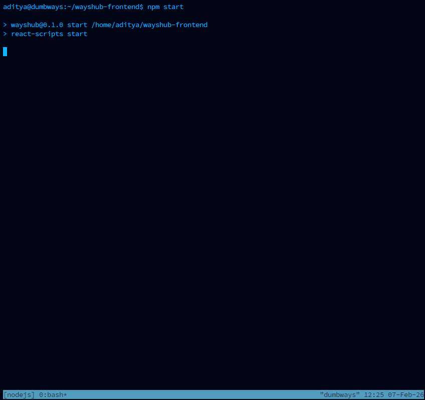

4.  Keluar dari sesi tmux (detach) dengan cara tekan ‘ctrl+b’, lalu tekan ‘d’  
    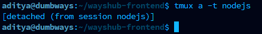

5.  Cek proses yang berjalan di background dengan perintah ‘ ps -a ‘  
    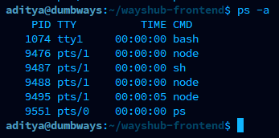

6.  Masuk ke direktori aplikasi python

7.  Jalankan perintah tmux, buat session baru untuk menjalankan aplikasi python ‘ tmux new -s python ‘

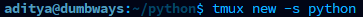

8.  Jalankan aplikasi python dengan perintah ‘ python3 index.py ‘  
    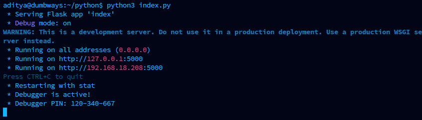

9.  Keluar dari sesi tmux (detach) dengan cara tekan ‘ctrl+b’, lalu tekan ‘d’  
    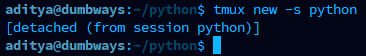

10. Cek proses yang berjalan di background dengan perintah ‘ ps -a ‘  
    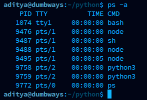

# Golang

Langkah – langkah agar aplikasi Golang bisa dibuka di browser dan menapilkan text "Jangan lupa sahur baby gurl rawr"

1.  Buat script golang, gunakan fitur net/http sebagai berikut

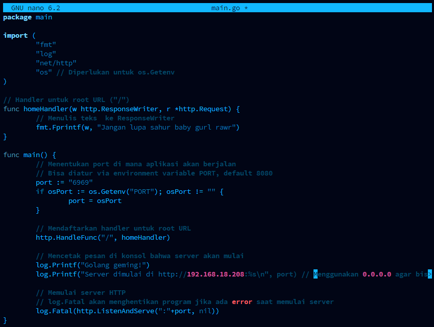

2.  Jalankan dengan perintah go main.go

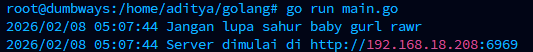

3.  Cek buka 192.168.18.208:6969 di web browser

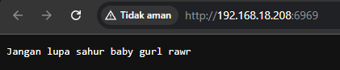
