# Task :

NodeJS

\- Deploy app wayshub-frontend

\- Berjalan di port 3000

\- Menggunakan NodeJS 10 & 12

\`\`\`https://github.com/dumbwaysdev/wayshub-frontend\`\`\`

Python

\- Deploy app menampilkan text nama kalian!

\- Berjalan di port 5000 & bisa dibuka melalui web

Golang

\- Deploy app menampilkan text "Golang geming!"

Note : Semua app WAJIB bisa diakses dengan \*\*UFW enabled\*\* (firewall menyala abangkuh 🔥🔥🔥)

# NodeJs

Langkah – langkah deploy :

1.  Install nodejs menggunakan nvm menggunakan perintah berikut.

\# Download and install nvm:

curl -o- https://raw.githubusercontent.com/nvm-sh/nvm/v0.40.3/install.sh \| bash

\# Restart shell

Exec bash

\# Download and install Node.js:

nvm install 12

\# Verify the Node.js version:

node -v

\# Verify npm version:

npm -v

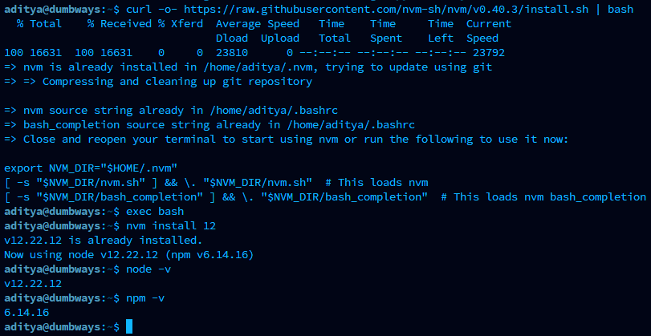

2.  Clone github repo <https://github.com/dumbwaysdev/wayshub-frontend> dengan perintah “ git clone <git@github.com:dumbwaysdev/wayshub-frontend.git> “

3.  Masuk ke direktori wayshub-frontend dan lakukan inisialisasi dengan perintah “npm i”

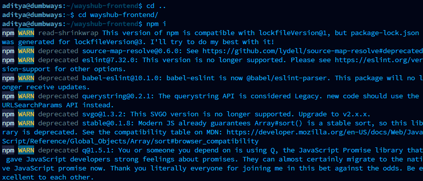 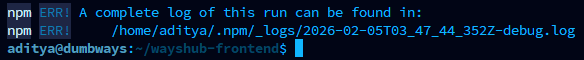

4.  Cek isi dalam direktori apakah sudah ada folder node_module

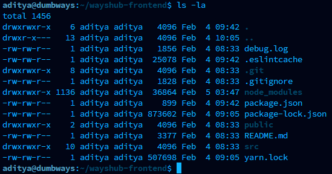

5.  Cek port 3000 pada UFW status apakah sudah Allow

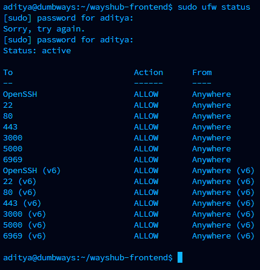

6.  Jika sudah, lakukan perintah npm start untuk menjalankan app nodejs

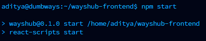

7.  Cek buka http://192.168.18.208/3000 pada web browser

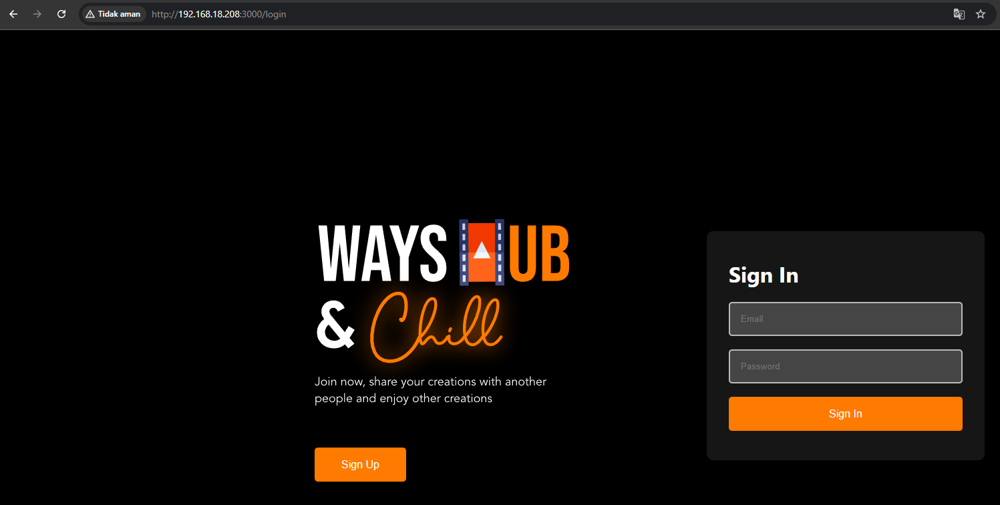

# Python

Langkah – langkah deploy :

1.  Cek apakah python sudah terinstall di server

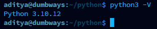

Jika belum, lakukan perintah “ sudo apt install python3 “ untuk installasi

2.  Cek apakah pip (package manager python) sudah terinstall di server

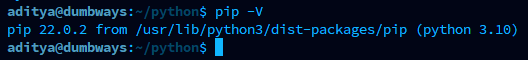

Jika belum, lakukan perintah “ sudo apt install python3-pip “ untuk installasi

3.  Install framework flask menggunakan perintah “ pip install flask “

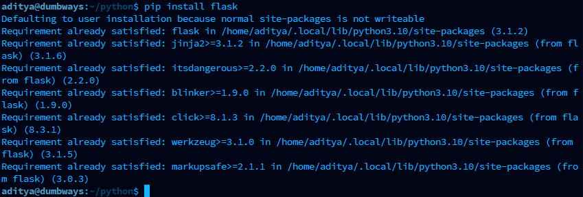

4.  Buat file.py / script aplikasi python yang menampilkan text nama pada web, gunakan perintah “ nano index.py “

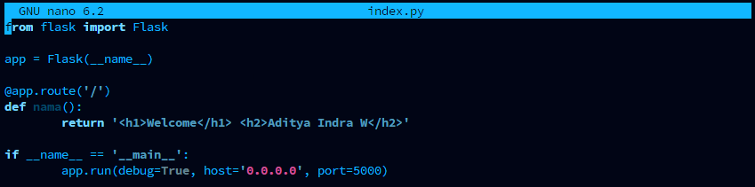

5.  Cek port 5000 pada UFW apakah sudah Allow

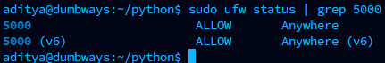

6.  Jika sudah, jalankan aplikasi python menggunakan perintah “ python3 index.py “

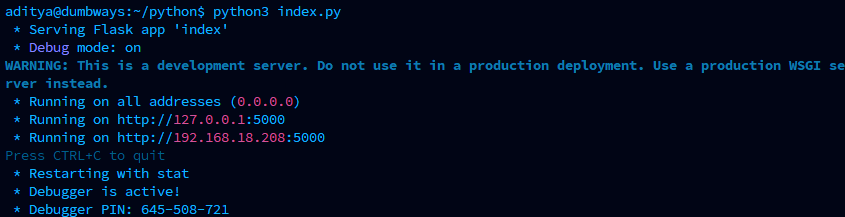

7.  Cek buka <http://192.168.18.208:5000> pada web browser

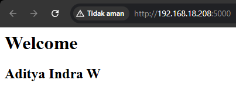

# Golang

Langkah – langkah deploy :

1.  Download file installasi golang pada server

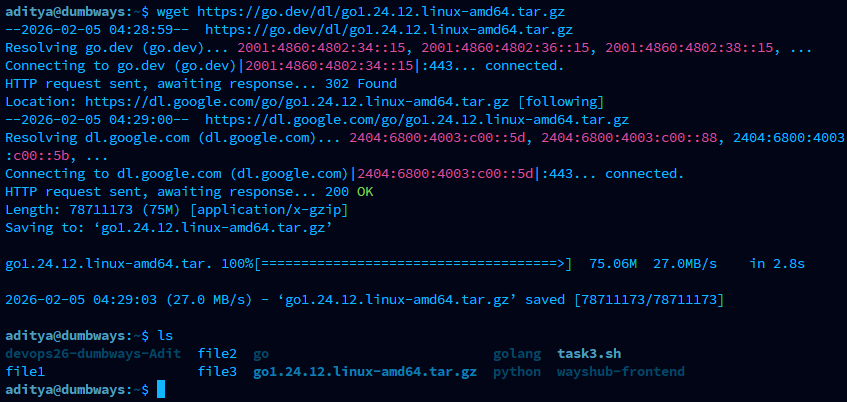

2.  Masuk sebagai admin dengan sudo su, lalu install menggunakan perintah “ rm -rf /usr/local/go && tar -C /usr/local -xzf go1.24.12.linux-amd64.tar.gz “, kemudian export path “ export PATH=\$PATH:/usr/local/go/bin “

3.  Cek versi golang

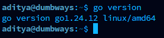

4.  Buat file.go / script aplikasi golang yang menampilkan text "Golang geming!". Gunakan perintah “ nano main.go “

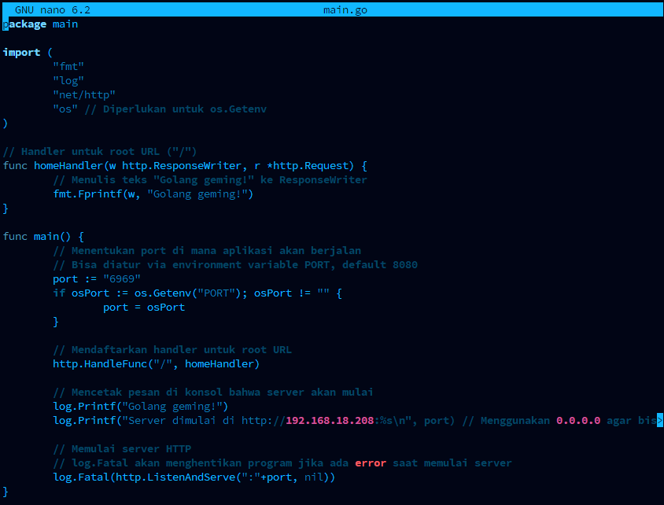

5.  Jalankan aplikasi dengan perintah “ go run main.go “

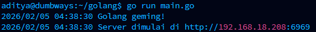

6.  Cek buka <http://192.168.18.208:6969> pada web browser

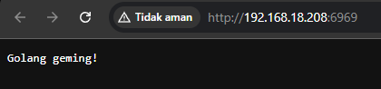
