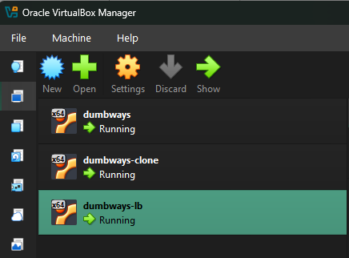
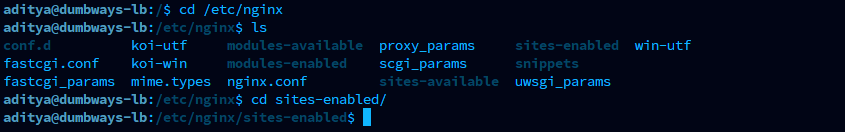
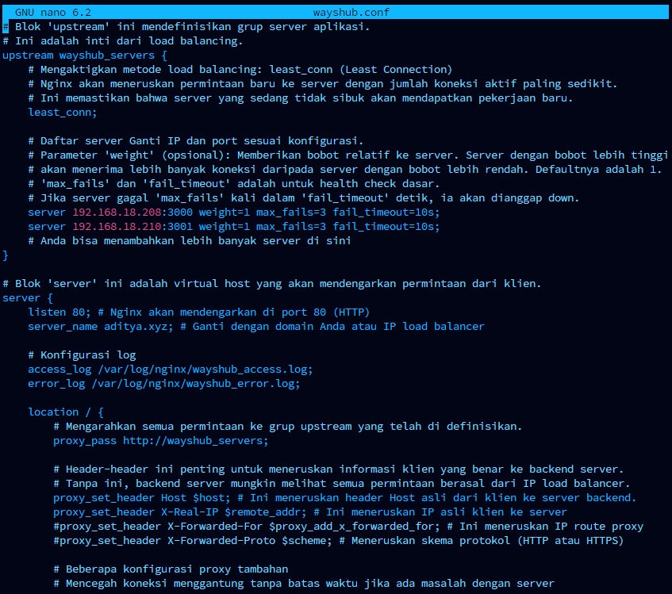
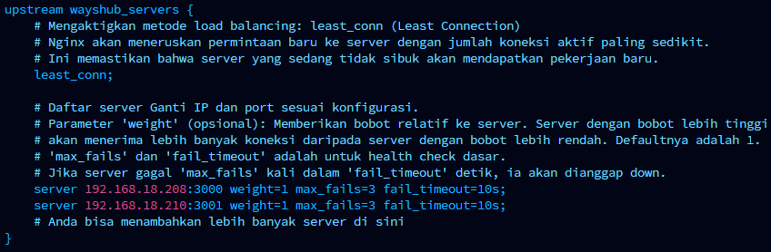
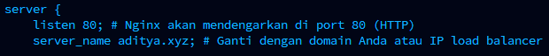
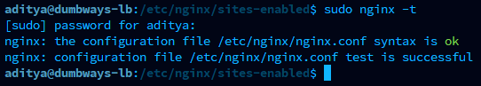
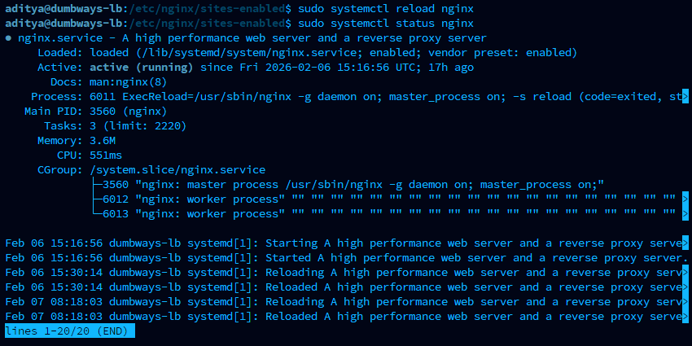
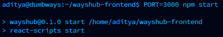
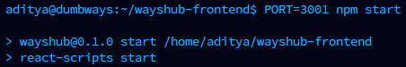

# Challenge :

1\. Terapkan Load Balancing untuk wayshub-frontend menggunakan 2 server dengan spek yang sama

2\. Gunakan 2 dari 3 pilihan method ini :

\- Round Robin

\- IP Hash

\- Least Connections

# Metode Load Balancing

## Round Robin:

- **Cara kerja:** Meneruskan permintaan secara berurutan ke setiap server di pool. Misalnya, permintaan pertama ke server A, kedua ke server B, ketiga ke server C, keempat kembali ke server A, dan seterusnya.

- **Kelebihan:** Sangat sederhana dan mudah diimplementasikan.

- **Kekurangan:** Tidak mempertimbangkan beban aktual server. Server yang lemah atau lambat mungkin menerima beban yang sama dengan server yang kuat.

## Weighted Round Robin:

- **Cara kerja:** Mirip dengan Round Robin, tetapi setiap server diberi "bobot" atau prioritas. Server dengan bobot lebih tinggi akan menerima lebih banyak permintaan daripada server dengan bobot lebih rendah.

- **Kelebihan:** Memungkinkan administrator untuk memberikan lebih banyak lalu lintas ke server yang lebih kuat atau memiliki kapasitas lebih besar.

- **Kekurangan:** Masih tidak secara dinamis menyesuaikan berdasarkan beban server *saat ini*.

## Least Connection:

- **Cara kerja:** Meneruskan permintaan baru ke server dengan jumlah koneksi aktif paling sedikit.

- **Kelebihan:** Sangat efektif dalam mendistribusikan beban secara merata di antara server, karena mempertimbangkan kapasitas aktual yang sedang digunakan.

- **Kekurangan:** Memerlukan load balancer untuk terus melacak jumlah koneksi aktif di setiap server.

## Weighted Least Connection:

- **Cara kerja:** Kombinasi dari Weighted Round Robin dan Least Connection. Server dengan bobot lebih tinggi dan jumlah koneksi aktif paling sedikit akan diprioritaskan.

- **Kelebihan:** Sangat efisien, menggabungkan keuntungan dari kedua metode.

## IP Hash:

- **Cara kerja:** Menggunakan alamat IP sumber (pengguna) dan/atau alamat IP tujuan (server virtual) untuk menghasilkan nilai hash yang kemudian digunakan untuk memilih server. Ini memastikan bahwa permintaan dari pengguna yang sama selalu diarahkan ke server yang sama.

- **Kelebihan:** Sangat berguna untuk aplikasi yang membutuhkan "sticky session" (sesi persisten), di mana pengguna harus selalu terhubung ke server yang sama untuk mempertahankan data sesi.

- **Kekurangan:** Jika satu server gagal, semua sesi yang terhubung ke server tersebut akan hilang, dan beban dapat menjadi tidak seimbang jika distribusi IP tidak merata.

# Penerapan Load Balancing Least Connection

Langkah – langkah :

1.  Siapkan 1 server khusus sebagai Load Balancing dan Reverse Proxy

2.  Siapkan 2 server untuk menjalankan aplikasi

> Di sini saya sudah membuat 3 buah vm server

- Vm dumbways adalah server pertama untuk aplikasi

- Vm dumbways-clone adalah server kedua untuk aplikasi

- Vm dumbways-lb adalah server untuk load balancing

> 

3.  Masuk ke vm server dumbways-lb jalankan nginx, jika belum ada install terlebih dahulu.

4.  Masuk ke direktori /etc/nginx/sites-enabled

5.  Buat file konfigurasi untuk load balancing, nano wayshub.conf

 

6.  Pada blok kode berikut isi dengan daftar ip server aplikasi. Di sini saya isi dengan 2 ip vm server yang saya gunakan untuk menjalankan aplikasi

7.  Pada kode blok berikut, sesuaikan dengan domain / ip dari vm server load balancer. Di sini saya mengisikannya dengan domain saya ‘aditya.xyz’

8.  Jika sudah selesai membuat file konfigurasi, lakukan test config. Pastikan status sukses / tidak ada error

9.  Lakukan reload/restart nginx

10. Cek ufw status, pastikan status ufw aktif dan port 80 sudah allow

11. Masuk ke vm server pertama untuk menjalankan server aplikasi. Jalankan aplikasi pertama dengan port 3000

12. Masuk ke vm server kedua dan jalankan aplikasi kedua dengan port 3001

13. Verifikasi apakah load balancing sudah berhasil. Di sini saya test dengan cara mengakses alamat domain server load balancer menggunakan web browser dan melakukan refresh beberapa kali untuk melihat apakah browser menampilkan tampilan server 1 dan server 2 secara bergantian.
[Video Demo](images/media/Test.mp4)
<video autoplay loop muted playsinline>
  <source src="images/media/Test.mp4" type="video/mp4">
</video>
