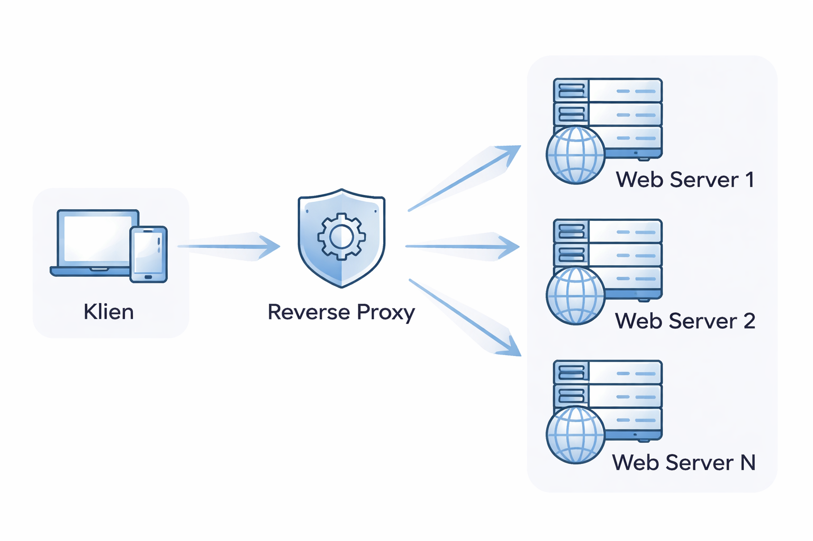
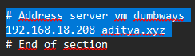
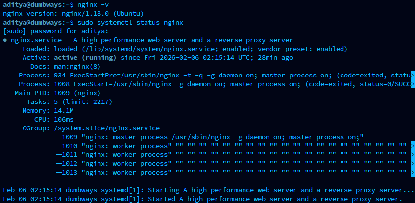
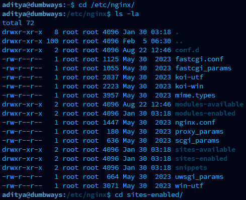
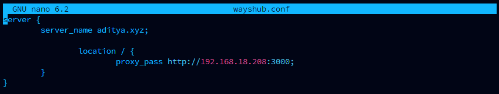
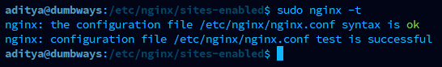
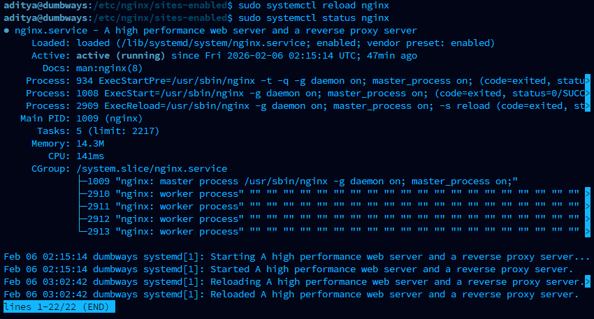
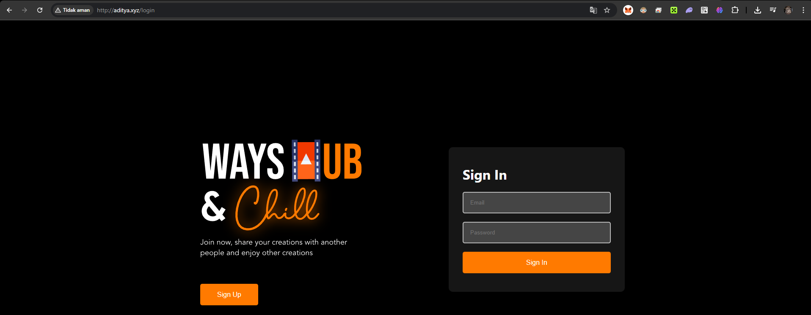

# Task :

1\. Gambarkan sturktur web server menggunakan reverse proxy dan jelaskan cara kerjanya!

2\. Buatlah Reverse Proxy untuk aplilkasi yang sudah kalian deploy kemarin. (wayshub), untuk domain nya sesuaikan nama masing" ex: ade.xyz .

# Struktur web server menggunakan reverse proxy

Gambar di atas menunjukkan struktur web server yang menggunakan reverse proxy.

**Cara Kerja Reverse Proxy**

Reverse proxy bertindak sebagai perantara antara klien (pengguna) dan satu atau lebih web server di belakangnya. Berikut adalah penjelasan cara kerjanya:

1.  **Permintaan Klien**: Ketika klien (misalnya, browser web di laptop atau ponsel) membuat permintaan ke suatu situs web, permintaan tersebut tidak langsung menuju ke web server yang menyimpan konten situs tersebut. Sebaliknya, permintaan itu pertama kali dikirim ke reverse proxy. Klien hanya mengetahui alamat IP atau nama domain dari reverse proxy, bukan alamat IP dari web server sebenarnya.

2.  **Reverse Proxy Menerima Permintaan**: Reverse proxy menerima permintaan dari klien. Pada titik ini, reverse proxy dapat melakukan beberapa hal, seperti:

    - **Load Balancing**: Jika ada beberapa web server (seperti "Web Server 1", "Web Server 2", hingga "Web Server N" dalam diagram), reverse proxy dapat mendistribusikan permintaan masuk ke server-server ini secara merata. Ini mencegah satu server kelebihan beban dan meningkatkan ketersediaan serta kinerja aplikasi.

    - **Keamanan**: Reverse proxy dapat menyaring permintaan berbahaya, memblokir serangan DDoS, atau mengenkripsi lalu lintas (SSL/TLS termination) sebelum diteruskan ke web server. Ini menambah lapisan keamanan pada infrastruktur.

    - **Caching**: Reverse proxy dapat menyimpan salinan konten yang sering diminta (misalnya, gambar atau halaman statis). Jika permintaan datang untuk konten yang sudah ada di cache, reverse proxy dapat langsung menyajikannya tanpa harus meneruskannya ke web server, sehingga mempercepat waktu respons.

    - **Kompresi**: Dapat mengompresi data sebelum mengirimkannya kembali ke klien, mengurangi bandwidth dan mempercepat pengiriman.

    - **Penskalaan Otomatis**: Memudahkan penambahan atau pengurangan web server di belakangnya tanpa memengaruhi konfigurasi klien.

3.  **Meneruskan Permintaan ke Web Server**: Setelah memproses (atau tidak memproses) permintaan, reverse proxy kemudian meneruskan permintaan tersebut ke salah satu web server yang sesuai di belakangnya. Pemilihan web server ini didasarkan pada aturan load balancing atau konfigurasi lainnya.

4.  **Web Server Memproses Permintaan**: Web server yang dipilih memproses permintaan seperti biasa, mengambil data atau menghasilkan konten yang diminta.

5.  **Mengirimkan Respons Kembali ke Reverse Proxy**: Web server mengirimkan responsnya kembali ke reverse proxy.

6.  **Reverse Proxy Meneruskan Respons ke Klien**: Reverse proxy menerima respons dari web server dan kemudian meneruskannya kembali ke klien yang membuat permintaan awal. Klien menerima respons seolah-olah itu berasal langsung dari web server, tanpa mengetahui adanya reverse proxy di tengah.

Dengan demikian, reverse proxy menyembunyikan arsitektur internal server, meningkatkan keamanan, mengoptimalkan kinerja, dan memungkinkan pengelolaan lalu lintas yang lebih baik.

# Reverse Proxy Aplikasi Wayshub

Langkah – langkah :

1.  Atur file host di lokal pc kita (path "C:\Windows\System32\drivers\etc\hosts").

Tambahkan konfigurasi berikut untuk menambahkan alamat server vm kita

2.  Buka server vm. Install dan jalankan nginx

3.  Atur configurasi nginx, tambahkan configurasi untuk server aplikasi kita. Masuk ke direktori /etc/nginx/sites-enabled/ 

4.  Lalu buat file dengan perintah sudo nano wayshub.conf dan isi file dengan configurasi server

5.  Test config apakah sudah sukses / ada error, gunakan perintah sudo nginx -t

6.  Reload nginx dan pastikan suda berjalan kembali

7.  Jalankan aplikasi wayshub di server dan buka http://aditya.xyz pada web browser

